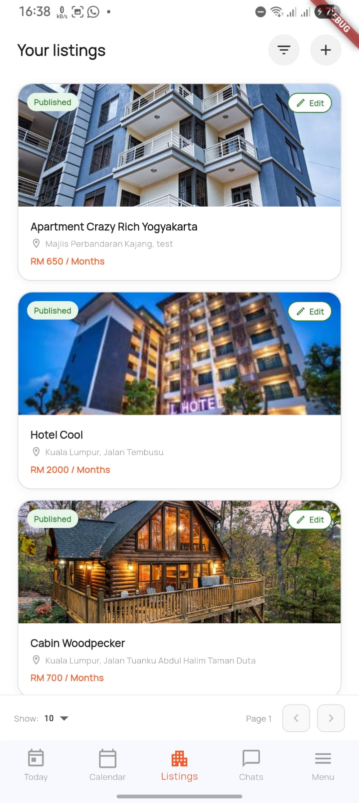
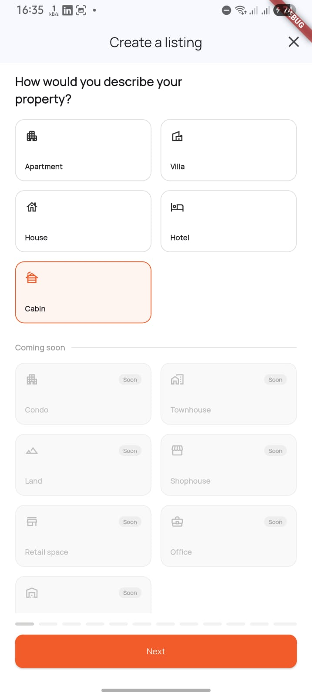
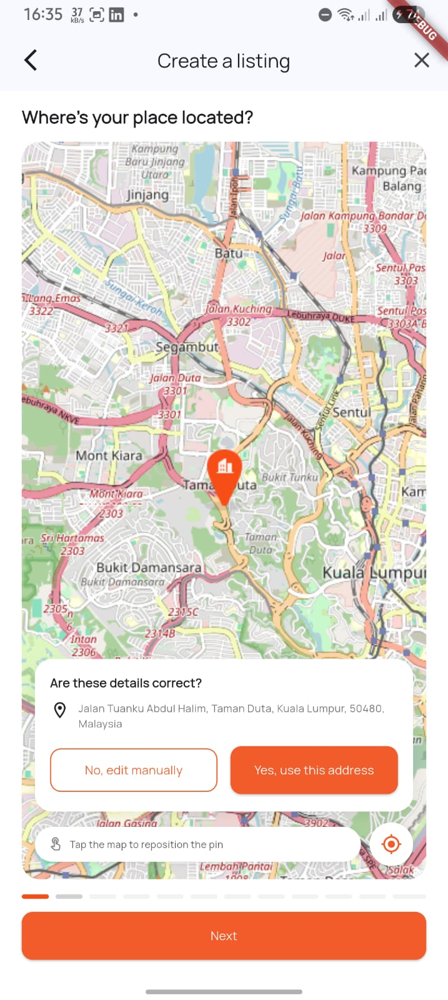
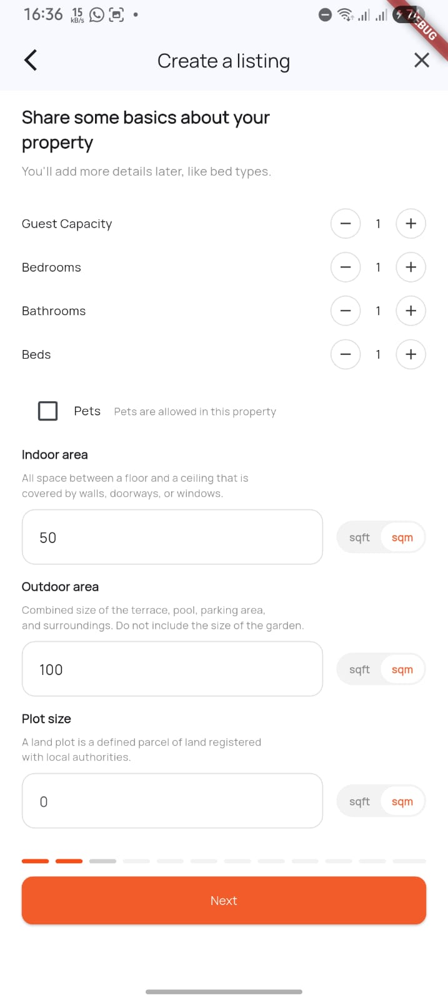
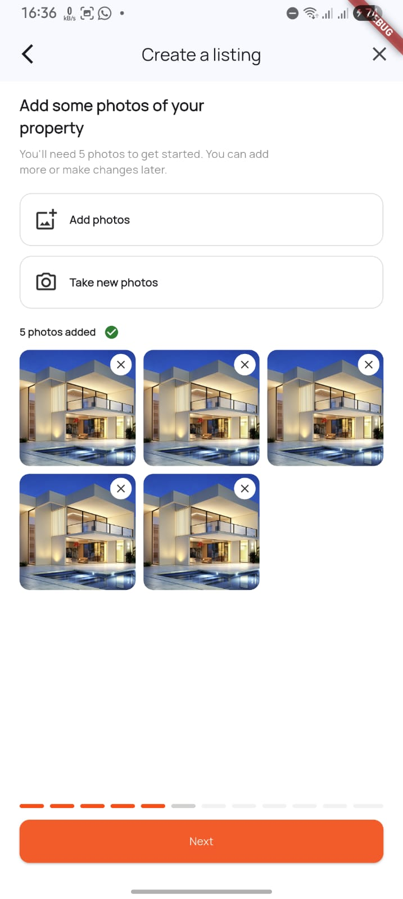
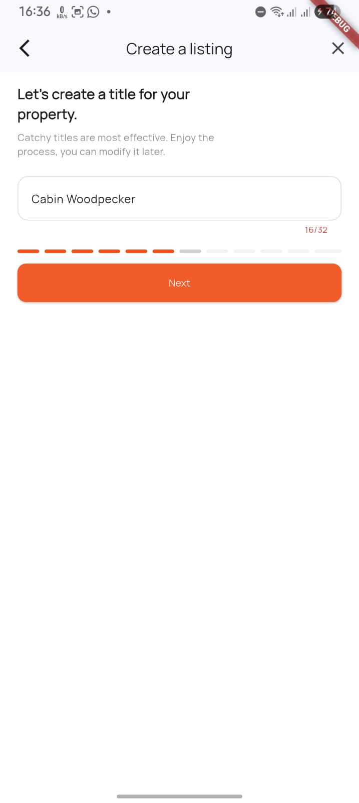
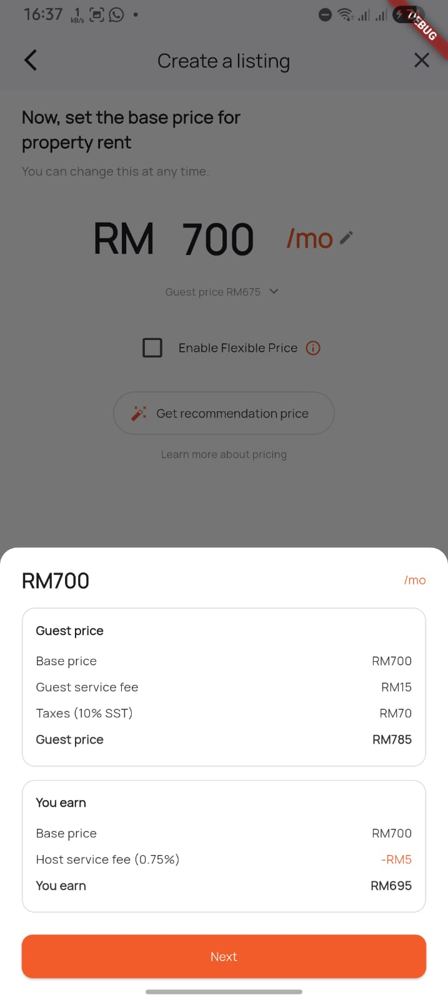
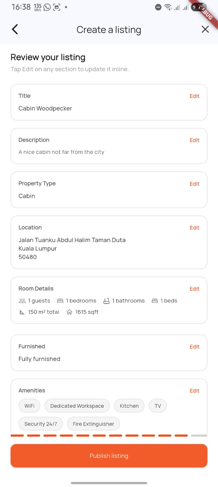
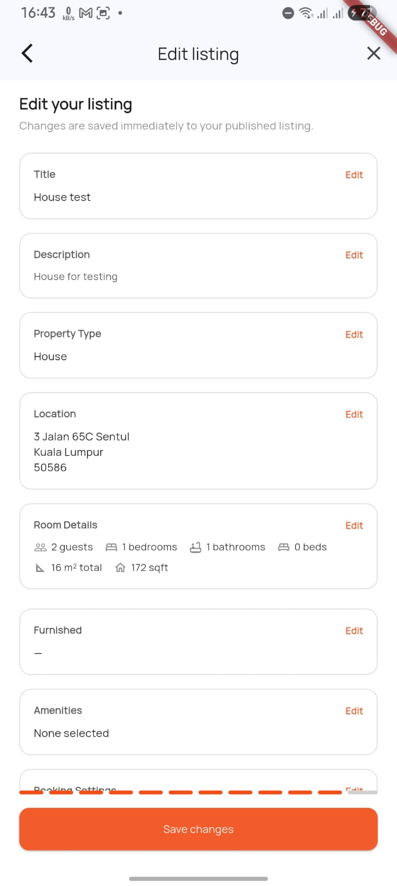

# RUUMI Property Listing (Flutter)

A Flutter mobile application implementing RUUMI's **Draft-to-Publish** property listing flow. Users create a listing through a 12-step form where every step is persisted to the backend, ensuring no data loss even if the app is force-closed mid-flow. Published listings can be edited inline from the listings page.

## How to Run

### Prerequisites

- Flutter SDK ≥ 3.9.2
- Dart SDK ≥ 3.9.2
- Android Studio / VS Code with Flutter extension
- An Android emulator or physical device

### Steps

```bash
# 1. Clone the repository
git clone https://github.com/CapDMarshal/ruumi-property-listing.git
cd ruumi-property-listing

# 2. Install dependencies
flutter pub get

# 3. Generate code (Freezed models, Riverpod providers, JSON serialization)
dart run build_runner build --delete-conflicting-outputs

# 4. Run the app
flutter run
```

> The app connects to the live API at `https://propertylisting-oyjm.onrender.com/api/v1/`. No additional backend setup is needed.

---

## Architecture & State Management

### State Management: Riverpod (with code generation)

Chosen for its compile-time safety, testability, and clean separation of concerns. The core state is managed by a `ListingDraft` notifier (`@riverpod class ListingDraft`) that:

- Tracks the current step, listing ID, loading state, and all form data (both API-backed and UI-only fields).
- Automatically initializes from local storage on app start (draft resumption).
- Persists progress after every successful API call.
- Exposes `loadForEdit()` to load a published listing for inline editing without affecting the draft flow.

### Architecture: Feature-First

```
lib/
 ┣ core/
 ┃ ┣ network/         → Dio client with interceptors and null-stripping for PATCH
 ┃ ┣ storage/         → SharedPreferences wrapper (draft + all UI-only fields)
 ┃ ┣ routing/         → go_router configuration
 ┃ ┗ exceptions/      → Custom ApiException (handles 422, timeouts, etc.)
 ┣ features/
 ┃ ┗ property_listing/
 ┃   ┣ data/
 ┃   ┃ ┣ models/      → Freezed + JSON Serializable models with numeric-string converters
 ┃   ┃ ┗ listing_repository.dart
 ┃   ┗ presentation/
 ┃     ┣ providers/   → ListingDraft notifier + listingsProvider (paginated)
 ┃     ┣ screens/
 ┃     ┃ ┣ listing_steps/  → 13 step screens (intro → review/publish)
 ┃     ┃ ┗ listings_page.dart
 ┃     ┗ widgets/     → StepProgressBar
 ┗ main.dart
```

### Key Libraries

| Purpose | Library |
|---------|---------|
| State Management | `flutter_riverpod` + `riverpod_annotation` |
| Networking | `dio` |
| Local Storage | `shared_preferences` |
| Routing | `go_router` |
| Models | `freezed` + `json_serializable` |
| Maps | `flutter_map` + `latlong2` |
| Typography | `google_fonts` |

---

## Application Flow (Draft-to-Publish)

The app implements a 12-step listing creation flow:

| Step | Screen | API Call | Persistence |
|------|--------|----------|-------------|
| 0 | Listings Home | `GET /listings/` (paginated) | — |
| 1 | Property Type | `POST /listings/` (creates draft) | SharedPreferences |
| 2 | Location & Address | `PATCH /listings/{id}` | API + SharedPreferences |
| 3 | Room Details | `PATCH /listings/{id}` | API + SharedPreferences (beds: local only) |
| 4 | Furnished | UI only | SharedPreferences |
| 5 | Amenities | UI only | SharedPreferences |
| 6 | Photos | UI only (5-photo minimum enforced) | SharedPreferences |
| 7 | Title | `PATCH /listings/{id}` | API + SharedPreferences |
| 8 | Description | `PATCH /listings/{id}` | API + SharedPreferences |
| 9 | Booking Settings | `PATCH /listings/{id}` | API + SharedPreferences |
| 10 | Price | `PATCH /listings/{id}` | API + SharedPreferences |
| 11 | Discounts | UI only | SharedPreferences |
| 12 | Review & Publish | `POST /listings/{id}/publish` | Clears draft on success |

Every time the user taps "Next", the app saves the current step's data to the backend and persists progress locally. UI-only fields (furnished, amenities, photos, discounts, beds) are stored in SharedPreferences and restored on resume.

---

## Listings Page Features

- **Paginated list** — fetches listings from `GET /listings/` with configurable page size (2, 5, 10, 20, 50; default 10). Prev/Next navigation with page indicator.
- **Filter by property type** — filter chip sheet fetches real types from `GET /property-types/`. Active filter shown in header with a clear option.
- **Property type images** — each card shows a type-specific thumbnail (`property-apartment.jpeg`, `property-villa.jpeg`, etc.).
- **Draft cards** — show a "Continue" chip, step progress bar, and are tappable to resume from the last saved step.
- **Published cards** — show an "Edit" chip and are tappable to open the review page in edit mode.
- **+ button** — clears any in-progress draft and starts a fresh listing flow.

---

## Draft Resumption (Force-Close Handling)

### How It Works

1. After every successful API call (create or update), `listing_id` and `current_step` are saved to **SharedPreferences** via `LocalStorageService.saveDraft()`.
2. UI-only fields (furnished status, amenities, photos, discounts, beds, property type label) are each saved to their own SharedPreferences keys immediately when changed.
3. On app startup, `ListingDraft.build()` reads all saved values from SharedPreferences and restores the full state.
4. The router navigates the user directly to the last saved step.
5. If `listingData` is null after a cold start (API data not persisted), `ensureListingDataLoaded()` fetches the listing from `GET /listings/` and populates all form fields reactively via `ref.listen`.
6. Upon successful publish, the entire draft (including all UI-only keys) is cleared from local storage.

### How It Was Tested

1. Started the app fresh, selected "Apartment" as property type (Step 1) — `POST /listings/` created a new draft with the correct UUID.
2. Proceeded through to Step 7 (Title), entered a title.
3. **Force-closed the app** from the Android task switcher (swipe away / "Force Stop" in App Info).
4. Reopened the app. `ListingDraft.build()` restored `listingId`, `currentStep = 8`, and all previously entered data from SharedPreferences.
5. The app navigated directly to Step 8 (Description). All previously filled fields on Steps 2–7 were pre-populated when navigating back.
6. Confirmed the listing ID was still valid by successfully calling `PATCH /listings/{id}` on the next step.

This proves that draft data is **not lost** on force-close because persistence happens immediately after each API success and each UI-only field change — not on app lifecycle events.

---

## Edit Mode (Published Listings)

Tapping a published listing card loads its data into the draft provider via `loadForEdit()` and opens the Review page in edit mode. In edit mode:

- The page title changes to "Edit listing".
- Each section has an inline Edit button that opens a bottom sheet — no navigation away from the review page.
- Every save in a sheet calls `PATCH /listings/{id}` immediately.
- The "Publish listing" button is replaced with "Save changes", which shows a confirmation Snackbar and returns to the listings page.

---

## Error & Validation Handling

### Network Errors
- A loading indicator is displayed during all API calls.
- Network timeouts and connection failures are caught by the Dio interceptor and surfaced to the user via Snackbar or Dialog.

### API Validation (422 Unprocessable Entity)
- The `ApiException` class parses the `detail` field from 422 responses.
- **Photo minimum**: tapping Next on the photos step with fewer than 5 photos shows a modal dialog: "Not enough photos — Minimum 5 photos required."
- **Publish 422**: if the publish endpoint returns a 422 (e.g. missing required fields), the error message is displayed in a red banner above the Publish button.

### Field-Level Rules
- `latitude` and `longitude` are always sent together (enforced before sending).
- the space wide (Indoor area, Outdoor area, Plot Size) must be > 0
- `base_price` must be > 0 (validated in the form before submission).
- `title` must be 10–32 characters (enforced with inline helper text and button guard).

---

## API References

- **Base URL**: https://propertylisting-oyjm.onrender.com/
- **Swagger UI**: https://propertylisting-oyjm.onrender.com/docs
- **Figma Design**: [Landlord Listing RUUMI](https://www.figma.com/design/R5I1Oy75M0iU2KwXCSdwZR/Landlord-Listing-RUUMI?node-id=0-1&t=ijy2hJFQlcX5HQYG-1)

---

## Screenshots

<!-- Add screenshots of the app flow here -->

| Listings Home | Step 1 - Property Type | Step 2 - Location |
|:-:|:-:|:-:|
|  |  |  |

| Step 3 - Room Details | Step 6 - Photos | Step 7 - Title |
|:-:|:-:|:-:|
|  |  |  |

| Step 10 - Price | Step 12 - Review | Published - Edit |
|:-:|:-:|:-:|
|  |  |  |

> Place your screenshots in `docs/screenshots/` and update the paths above.

---

## Known Limitations

- **Photo upload** is simulated — photos use a local asset (`property.jpeg`) as a placeholder. Real multipart upload to the backend is not yet wired.
- **Amenities, furnished state, and discounts** are persisted locally but not sent to the API (no corresponding fields in the current schema).
- **Unit and integration tests** are not yet implemented.
